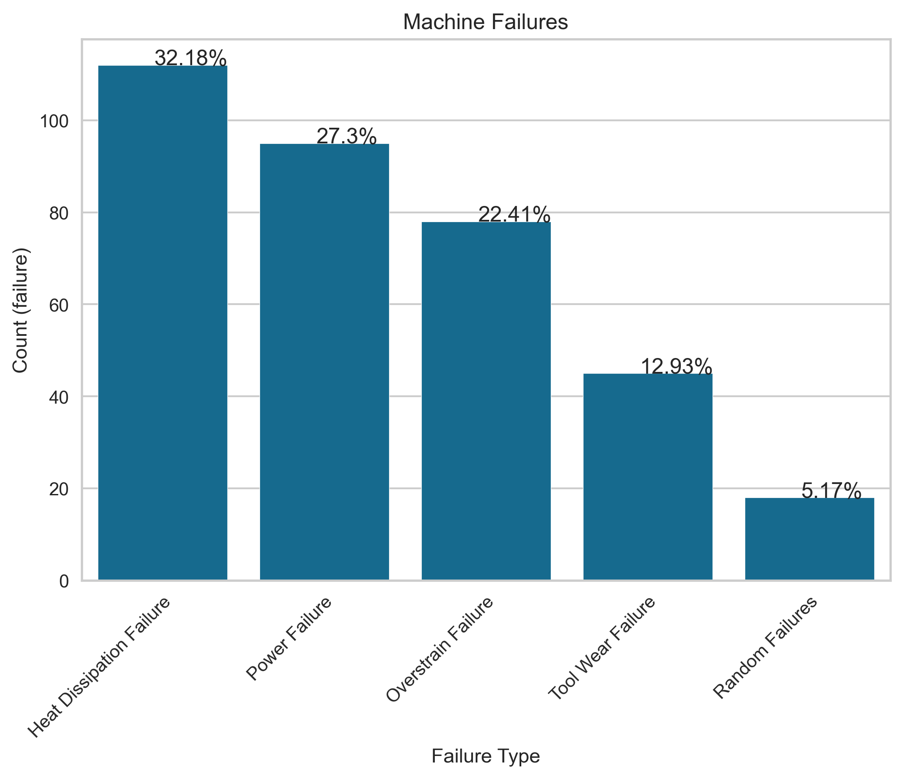

# Machine Predictive Maintenance using Failure Classification
***
Tim Fuger

## Disclaimer

The following project is a hypothetical scenario. Since real predictive maintenance datasets are generally difficult to obtain and in particular difficult to publish, we present and provide a synthetic dataset that reflects real predictive maintenance encountered in the industry to the best of our knowledge.

## Project Overview

A manufacturer in custom metal products (Northrup Grumman) has approached our company looking to reduce the amount of downtime on their machines in their facility. In order to do so, they intend to focus on preventative maintenance procedures to avoid machine failures. A machine failure can occur for a variety of reasons which leads to a stop in the manufacturing process, and is creating a bottleneck in production at times when their machines are most needed. In addition, some failures result in damage to the machine, which can incur additional maintenance over time. 

They would like a product that can predict when a failure would occur. In addition, if a failure does occur, we want to identify what type of failure would occur. If we should be successful in assisting their company, they would be willing to invest additional resources gathering data for other machines in order to reduce downtime for them as well. They have a high requirement in predicting as few false negatives (predicting a no failure when it would really be a failure) as possible. It costs little additional money to setup preventative maintenance and plan for a false positive, but a false negative would mean an unexpected failure. This and false negatives would be detrimental to downtime for the machines and costly for the business.

### Data

The manufacturing company has provided us with an estimated 428 hours of data for one of their machines. The dataset providede consists of 10 000 data points stored as rows with 9 columns

| Column Name  | Description  |
|---|---|
| UID  | unique identifier ranging from 1 to 10000  |
| productID  | consisting of a letter L, M, or H for low (50% of all products), medium (30%), and high (20%) as product quality variants and a variant-specific serial number  |
| air temperature [K]  | generated using a random walk process later normalized to a standard deviation of 2 K around 300 K  |
| process temperature [K]  | generated using a random walk process normalized to a standard deviation of 1 K, added to the air temperature plus 10 K  |
| rotational speed [rpm]  | generated using a random walk process normalized to a standard deviation of 1 K, added to the air temperature plus 10 K  |
|  torque [Nm] |  torque values are normally distributed around 40 Nm with an σ = 10 Nm and no negative values |
| tool wear [min]  |  The quality variants H/M/L add 5/3/2 minutes of tool wear to the used tool in the process |
| Target  |  label that indicates, whether the machine has failed in this particular data point for any of the following failure modes are true |
| Failure Type  | Organized into 5 different types: No Failure, Heat Dissipation Failure, Power Failure, Tool Wear Failure, Random Failure  |

### Data Preprocessing

The five failures that occur in the dataset are distributed as follows:

The first step was to remove the random failures, and to remove any rows with conflicting data between the target and failure type column. After this, we plot the failures based on category to get a general sense of how the failures correlate with features.

We immediately started to see trends in the data for what we wanted to avoid when machining, such as:
- Torque (related to power failure): less than 20 Nm or more than 58 Nm
- Tool Wear(related to tool wear failure): more than 190 minutes of use
- Rotational speed (related to overstrain and heat dissipation failure): less than 1200 rpm

## Modeling and Model Interpretation

We created 3 baseline classifier models using Knearest neighbors, Balanced Bagging, and Random Forest.  We found that the Random forest and Balanced Bagging models performed the best, and we took those 2 models and applied a StandardScaler to the model but that decreased performance. We then used GridSearchCV to tune the hyper parameters for Random Forest and obtain better results. We ultimately ended up with a Balanced Bagging model that reduced the number of false negatives we had to only 9 for the multiclass model and 6 for the binary model.

After determining our final model, we determined the importance of each variable, which can help the client which variables to focus on first in their new maintenance program they intend to implement to prevent these failures. Torque is the most important features that factors into the failure.

We removed the upper and lower bounds of the data as they relate to torque. Removing this data not only removed a number of failures but also increased the results of our model when run through this new dataset. The binary model with this data only predicted 1 false negative out of 1904 data points.

### Next Steps

Next steps beyond this investigation would be to:

- Collect additional data on the current machine being analyzed. The current model has good results, but we would want to confirm those results by testing the model on additional data.
- This data only applies to one machine for the Northrup Grumman plant. We would want to start to collect data on the other machines in the plant to determine failures for those machines as well. The end result is to improve the efficiency for the whole manufacturing process and not just one step in the process.

## Repository Navigation

In this repository you will find 5 files to take note of:

- [Jupyter Notebook](Notebook.ipynb) contains all of the code for this project

- [predictive maintenance](data/predictive_maintenance.csv) contains the data from 

- [images](images) folder contains all the images that are used in the markdown file

- [Machine Predictive Maintenance](Machine-Predictive-Maintenance.pptx) powerpoint file

- [Machine Predictive Maintenance](Machine-Predictive-Maintenance.pdf) pdf file

For additional info, contact Tim Fuger at tfuger10@gmail.com